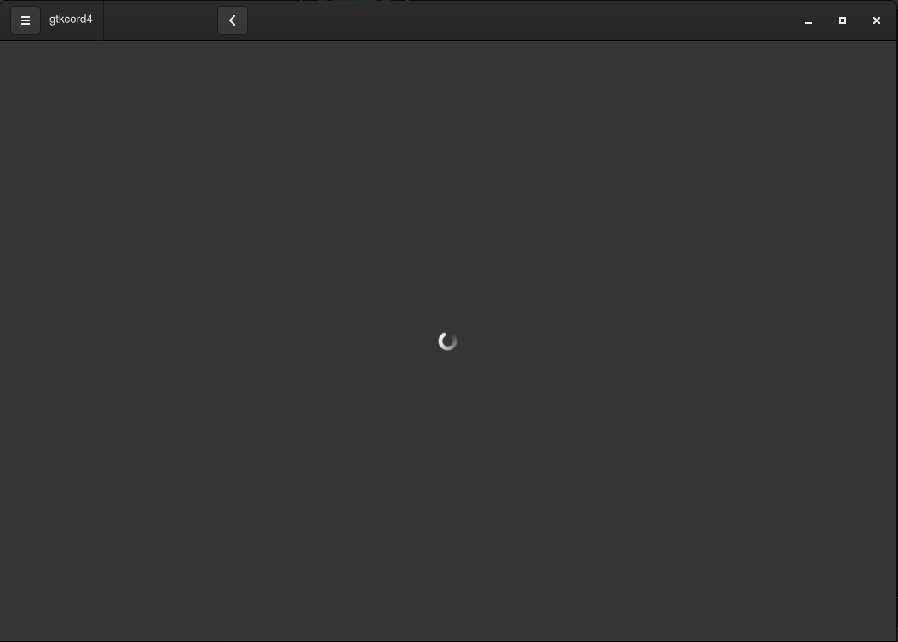

	

<h1 align="center">gtkcord4-js</h1>

A lightweight Discord client which uses GTK4 for the user interface. Rewritten in typescript.

***

This project is in the early stages the real functionality doesn't work so please don't think you can use this yet. Also oops I didn't realize I should name this gtkcord4 :/

